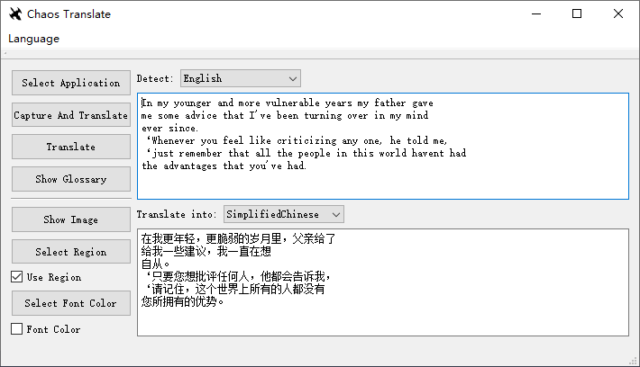

# Introduction
ChaosTranslate is a lightweight tool to automatically detect and translate charactors on Windows platform. It uses [Tesseract OCR](https://github.com/tesseract-ocr/tesseract) to detect characters inside the screenshot of user-selected application and [QtOnlineTranslator](https://github.com/crow-translate/QOnlineTranslator) to translate into target language.

   

# Requirements   
1. [CMake](https://cmake.org/install/) (prefered > 3.18.0)      
2. [Qt5](https://github.com/qt/qt5)   
3. [TesseractOCR](https://tesseract-ocr.github.io/tessdoc/Compiling.html#windows)   

# Installation   
1. Make sure all dependencies in Requirements are installed  
2. Clone this branch and update submodule
  >git submodule update --init --recursive
3. Compile using CMake
